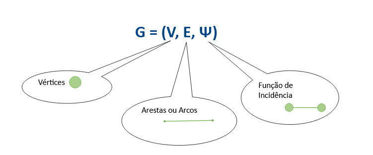
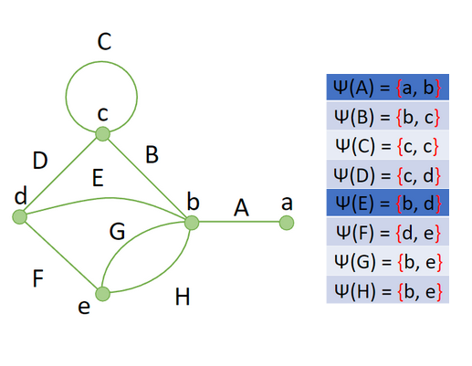
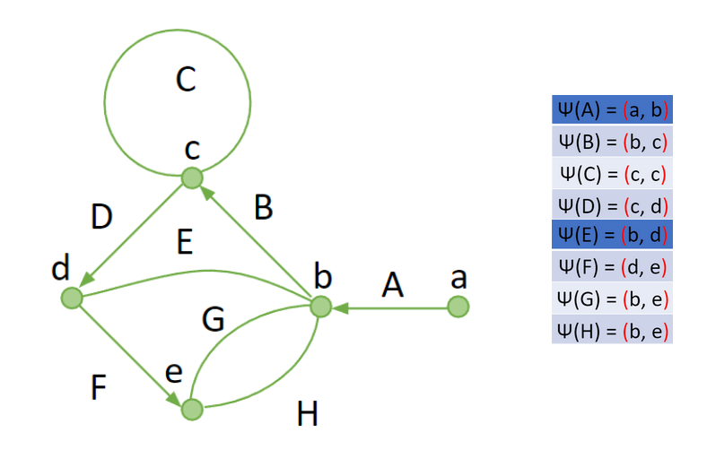
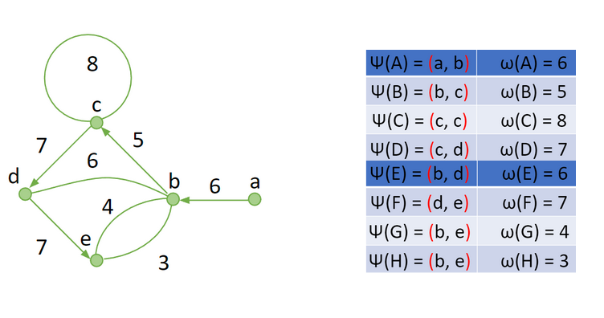
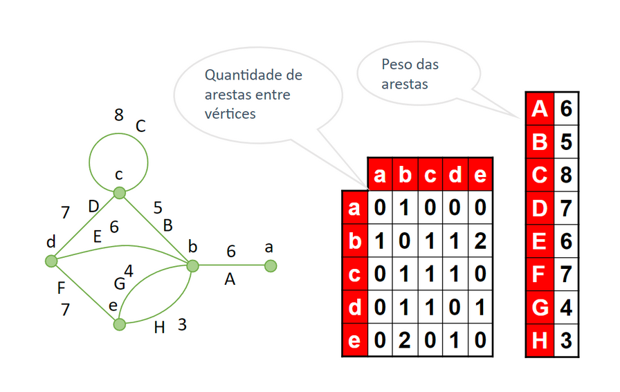
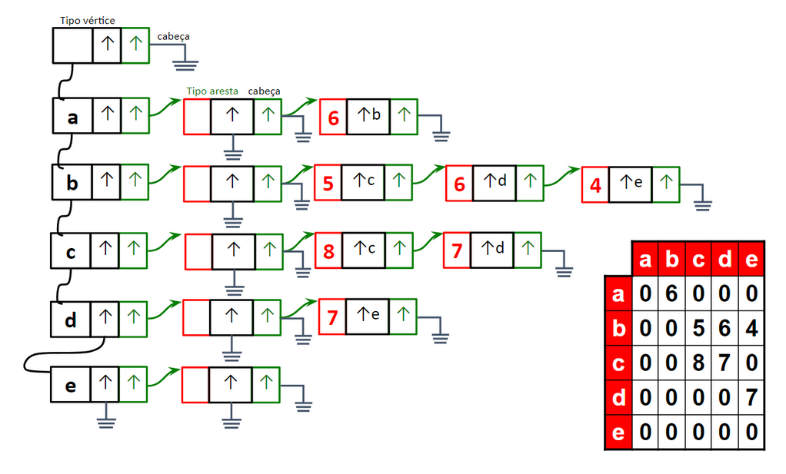

[Voltar para o repositório principal :house:](https://github.com/rmnicola/m6-ec-encontros.git)

# Introdução à grafos e Gazebo <!-- omit in toc -->

## Objetivos do encontro
* Apresentar os conceitos matemáticos relacionados aos grafos.
* Apresentar as principais formas de se representar grafos computacionalmente.
* Demonstrar o funcionamento do Gazebo, incluindo a interação com o robô turtlebot3 Burger.
* Introduzir o conceito de pacotes em ROS e criar nosso primeiro pacote.

## Conteúdo <!-- omit in toc -->
- [Objetivos do encontro](#objetivos-do-encontro)
- [Introdução à grafos](#introdução-à-grafos)
  - [Terminologia](#terminologia)
  - [Representação computacional](#representação-computacional)
  - [Buscas em grafos](#buscas-em-grafos)
- [Interagindo com o Gazebo](#interagindo-com-o-gazebo)
  - [Instalando o Gazebo](#instalando-o-gazebo)
  - [Problemas comuns com o gazebo](#problemas-comuns-com-o-gazebo)
    - [O gazebo abre a interface gráfica, mas o ambiente de simulação está só com uma tela preta](#o-gazebo-abre-a-interface-gráfica-mas-o-ambiente-de-simulação-está-só-com-uma-tela-preta)
  - [Publicando velocidades para o turtlebot no Gazebo](#publicando-velocidades-para-o-turtlebot-no-gazebo)
  - [Subscrevendo odometria do turtlebot no Gazebo](#subscrevendo-odometria-do-turtlebot-no-gazebo)
- [Criando pacotes em ROS](#criando-pacotes-em-ros)
  - [Erros comuns](#erros-comuns)
  
## Introdução à grafos
  
Grafos são estruturas abstratas de dados que consistem em um conjunto de nós (também conhecidos como vértices) conectados por arestas. Eles desempenham um papel fundamental na programação, oferecendo uma representação poderosa e flexível para modelar relações e interconexões entre objetos. Grafos são amplamente utilizados em diversas áreas da programação, como algoritmos de busca e otimização, sistemas de recomendação, redes de computadores, análise de dados e muito mais. Com a ajuda de grafos, é possível resolver problemas complexos de maneira eficiente e elegante, representando entidades e suas conexões por meio de uma estrutura que reflete as relações do mundo real. Isso torna os grafos uma ferramenta essencial para o desenvolvimento de soluções inteligentes e escaláveis em programação.

### Terminologia



Um grafo simples consiste em um conjunto não vazio de **vértices** e um conjunto de **arestas** que pode ou não ser vazio. Cada aresta é um conjunto de dois vértices. A **função de incidência** descreve a ligação feita por uma aresta. Um grafo pode ser **direcionado** ou não e também pode ser **ponderado** ou não.

Exemplo de **grafo simples**:



Exemplo de **grafo direcionado**:



Exemplo de **grafo direcionado ponderado**:


### Representação computacional

Existem diferentes formas de representar um grafo computacionalmente, cada uma com suas características e usos específicos. Duas das principais formas de representação são a matriz de adjacência e a lista de adjacência.

A **matriz de adjacência** é uma matriz bidimensional em que cada linha e coluna representam os vértices do grafo. O valor armazenado em cada posição da matriz indica se há uma aresta entre os vértices correspondentes. Essa representação é útil quando o grafo é denso e a verificação da existência de uma aresta é uma operação frequente. No entanto, ela requer uma quantidade de memória proporcional ao quadrado do número de vértices, o que pode ser ineficiente para grafos grandes.

Exemplo de **matriz de adjacência**:



Já a **lista de adjacência** é uma estrutura que associa cada vértice a uma lista que contém os vértices adjacentes a ele. Essa representação é eficiente para grafos esparsos, pois requer memória proporcional ao número de vértices e arestas presentes no grafo. Além disso, ela permite o acesso rápido aos vértices adjacentes a um determinado vértice, facilitando a implementação de algoritmos que exploram as relações entre os vértices.

Exemplo de **lista de adjacência**:



Ambas as formas de representação têm suas vantagens e desvantagens, e a escolha entre elas depende do tipo de grafo, das operações a serem realizadas e dos requisitos de desempenho do sistema em que o grafo será utilizado.

### Buscas em grafos

A busca em largura e a busca em profundidade são algoritmos de busca utilizados em grafos para percorrer e explorar seus vértices e arestas.


<p style="margin-left: 15%">Imagem retirada de <a href="https://www.codecademy.com/article/tree-traversal">Codecademy</a></p>

A **busca em largura** (BFS - Breadth-First Search) utiliza uma fila para a busca. O algoritmo começa a partir de um vértice inicial e explora todos os seus vértices vizinhos antes de prosseguir para os vértices vizinhos dos vizinhos. Essa abordagem garante que a busca seja feita em camadas, ou seja, primeiro são visitados todos os vértices que estão a uma aresta de distância, em seguida, os que estão a duas arestas de distância e assim por diante. A busca em largura é eficiente para encontrar o caminho mais curto entre dois vértices e também para verificar se um grafo é conexo.


<p style="margin-left: 15%">Imagem retirada de <a href="https://www.codecademy.com/article/tree-traversal">Codecademy</a></p>

Já a **busca em profundidade** (DFS - Depth-First Search) utiliza uma pilha para a busca. O algoritmo explora um vértice inicial e segue por uma ramificação do grafo o mais profundamente possível antes de retroceder e explorar outras ramificações. Isso significa que, ao encontrar um vértice não visitado, o algoritmo faz uma chamada recursiva para explorar esse vértice e seus vizinhos antes de retornar e continuar a busca. A busca em profundidade é útil para encontrar ciclos em um grafo, identificar componentes conexos e realizar travessias em grafos não direcionados.

A escolha entre busca em largura e busca em profundidade depende do problema em questão. Se o objetivo é encontrar o caminho mais curto entre dois vértices ou verificar a conectividade do grafo, a busca em largura é mais adequada. Por outro lado, se o objetivo é explorar todas as ramificações do grafo de forma mais aprofundada, identificar ciclos ou realizar análises mais complexas, a busca em profundidade é mais indicada. Ambos os algoritmos desempenham papéis importantes na solução de problemas relacionados a grafos.

## Interagindo com o Gazebo

### Instalando o Gazebo
[](https://www.youtube.com/watch?v=h4D3IqKRToQ)

Antes de começarmos, verifique se você possui o ROS 2 instalado em seu sistema e se já configurou o seu ambiente de trabalho do ROS 2. Se não tiver feito isso, você pode seguir o guia de instalação e configuração do ROS 2 em https://docs.ros.org/en/humble/Installation.html.

A seguir, instale todos os pacotes relacionados ao turtlebot 3 utilizando o seguinte comando:

```bash
sudo apt install ros-humble-turtlebot3*
```

Antes de iniciar a simulação, precisamos definir o modelo do robô a ser utilizado pelo gazebo. Para isso, utilizaremos uma variável de ambiente. Rode o comando abaixo:

```bash
echo "export TURTLEBOT3_MODEL=burger" >> ~/.bashrc
```

Após rodar esse comando, é necessário dar source novamente na configuração do bash. Rode:

```bash
source ~/.bashrc
```

Pronto. Agora está tudo certo para rodar a simulação do turtlesim utilizando o gazebo. É possível iniciar o gazebo e depois manualmente carregar o modelo do turtlebot, mas já existe um lançador que faz isso automaticamente. Rode:

```bash
ros2 launch turtlebot3_gazebo empty_world.launch.py
```

Note que o argumento `empty_world.launch.py` define qual cenário será aberto no gazebo. Tente executar o mesmo comando utilizando `turtlebot3_world.launch.py` em seu lugar.

Para mover o robô simulado basta interagir com os mesmo tópicos que existiriam no robô físico. Em específico, podemos utilizar o pacote `turtlebot3_teleop` para enviar mensagens para o tópico `cmd_vel`. Para lançar o teleop, rode:

```bash
ros2 run turtlebot3_teleop teleop_keyboard
```

### Problemas comuns com o gazebo

#### O gazebo abre a interface gráfica, mas o ambiente de simulação está só com uma tela preta

Isso ocorre pois o gazebo não está conseguindo acessar o recurso de aceleração 3D. **Caso esteja utilizando o notebook do Inteli** ou qualquer outro computador com placa de vídeo integrada Intel, tente atualizar os drivers de vídeo. Se ainda assim não funcionar, a opção passa a ser desabilitar a aceleração gráfica. Rode:

```bash
echo "export LIBGL_ALWAYS_SOFTWARE=true" >> ~/.bashrc
```

e depois:

```bash
source ~/.bashrc
```

Note que essa opção vai diminuir consideravelmente a performance do seu ambiente de simulação.

### Publicando velocidades para o turtlebot no Gazebo
[](https://www.youtube.com/watch?v=jJDpj2BRSeM)

### Subscrevendo odometria do turtlebot no Gazebo
[](https://www.youtube.com/watch?v=neJqpCAP9H4)

## Criando pacotes em ROS

O primeiro passo para criar um pacote em ROS é criar uma pasta para servir de workspace. Para fazer isso, rode:
```console
mkdir -p ros2_ws/src
```
Após criada a pasta, entre nela com:
```console
cd ros2_ws
```
Agora, crie toda a estrutura necessária para o seu workspace:
```console
colcon build
```
(Aqui, caso você receba um aviso/erro de `SetuptoolsDeprecationWarning`, recomendamos recorrer a área de [Erros comuns](#erros-comuns)).

Note que agora você tem uma estrutura completa com diversas pastas. Uma delas é a pasta `install`, que serve para adicionar o seu workspace e os pacotes nele contidos à instalação do seu ROS2. Para fazer isso, rode:
```console
source install/setup.bash
```
Agora já podemos criar o nosso pacote em Python. Mova-se para a pasta src com:
```console
cd src
```
E rode:
```console
ros2 pkg create {nome-do-pacote} --build-type ament_python --dependencies rclpy
```
Onde o `{nome-do-pacote}` deve ser substituído por, bem, o nome do seu pacote :D

O pacote criado pelo ros2 terá precisamente a mesma estrutura de pastas de um pacote típico Python. Porém agora precisaremos criar um novo `entry_point`, para isso precisaremos primeiro entrar em seu `__init__.py`(localizado em `src > {nome-do-pacote} > {nome-do-pacote} > __init__.py`) pelo VSCode(via conexão WSL) e escrever uma função para conseguirmos executar com o `entry_point`, vamos criar um `hello_world`:
```python
def hello_world():
  print("Hello World! :)")
```

Agora, precisaremos ir até o `setup.py` do nosso pacote(localizado em `src > {nome-do-pacote} > setup.py`), para assim adicionarmos o `entry_point` que iremos executar:

```python
[...]
  entry_points={
  'console_scripts': [
    '{nome-do-entrypoint} = {nome-do-pacote}:hello_world',
  ],
},

[...]
```
Após isso, precisaremos voltar a nossa pasta raíz do workspace com o seguinte comando:
```console
cd ..
```

Agora compilaremos o pacote, rodando:
```console
colcon build --packages-select {nome-do-pacote}
```

E então, recarregaremos nossos pacotes do ROS utilizando o comando source novamente:
```console
source install/setup.bash
```


Após isso, poderemos executar o nosso pacote e seu executável rodando:
```console
ros2 run {nome-do-pacote} {nome-do-entrypoint}
```

Onde `{nome-do-entrypoint}` é o entrypoint do seu pacote Python. Caso tenha dificuldades com o entrypoint, recomendamos dar uma olhada [neste](https://packaging.python.org/guides/distributing-packages-using-setuptools/#entry-points) tutorial.

### Erros comuns
Caso na hora de criar seu workspace com o `colcon`, utilizando o comando "`colcon build`", você receba um erro de `SetuptoolsDeprecationWarning`, que muito provavelmente acontecerá se você estiver utilizando o WSL, para resolver é muito simples, digite comando por comando no terminal:
```console
sudo apt install python3-pip
pip3 install setuptools==58.2.0
```
Após isso, você poderá seguir o tutorial.